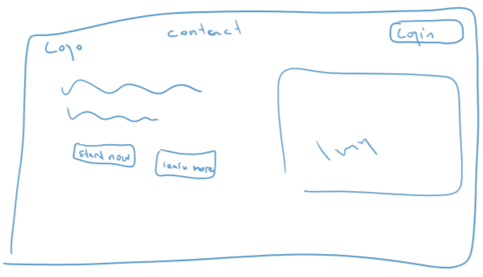
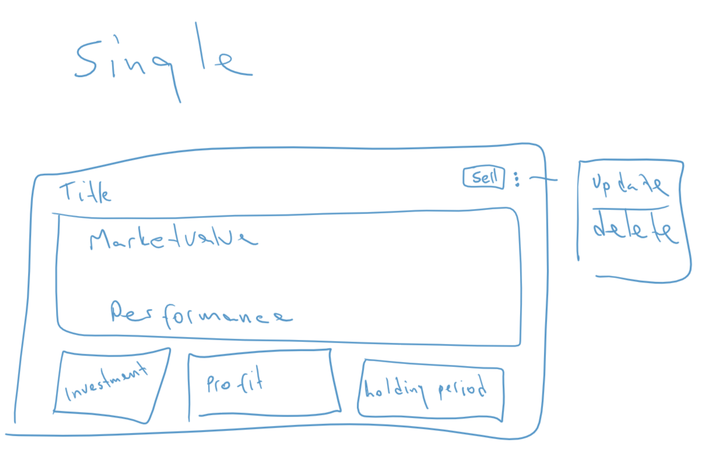
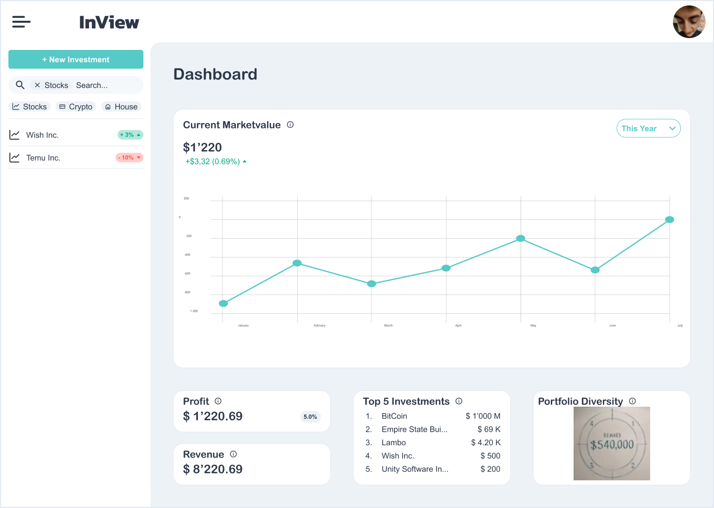
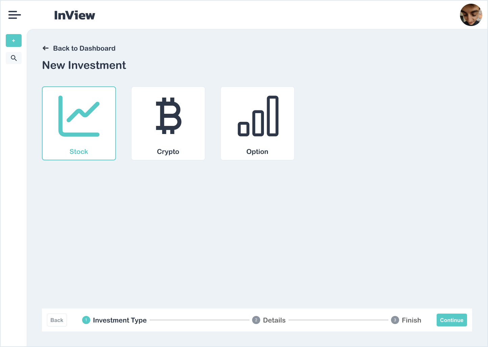
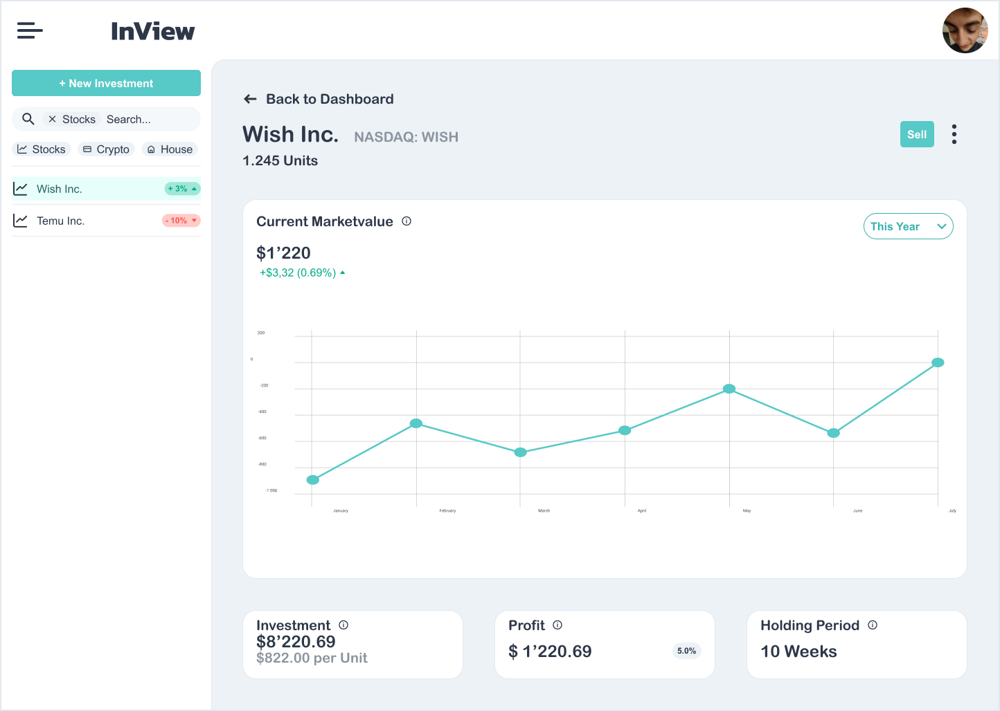

# Portfolio Dashboard

Ziel ist es, eine Webapp zu entwickeln, mit der eine Privatperson sein Investitionsportfolio an einem zentralen Ort überwachen kann. Die App soll die Möglichkeit bieten, Aktien, Immobilien, Fahrzeuge, Kryptowährungen und andere Investitionen einzutragen und deren Performance zu überwachen.

## Umfang

### Core

1. Aktien im Portfolio eintragen / löschen
2. Aktien API anbinden um echt Zeit Preise anzuzeigen
3. Andere Investitionen eintragen / löschen / bearbeiten (Immobilien, Fahrzeuge, Kryptowährungen, etc.)
4. Statistiken über die Performance der Investitionen anzeigen (Gewinn oder Verlust, Kursdiagramm)
5. Dashboard mit Gesamtperformance des Portfolios anzeigen (Gewinn oder Verlust, Kursdiagramm)

### Additional

1. Preis Benachrichtigung (bei Aktienpreis x E-Mail versenden)

## Use Cases

### Use Case Diagramm


### Core

_UC01_: Als Benutzer möchte die Startseite sehen, um mich über die App zu informieren. \
_UC02_: Als Benutzer möchte ich die Datenschutzerklärung sehen, um mich über die Verarbeitung meiner Daten zu informieren. \
_UC03_: Als Benutzer möchte ich eine Seite sehen, welche die Betreiber der App vorstellt, um mich über die App zu informieren. \
_UC04_: Als Benutzer möchte ich Kontakt zu den Betreibern der App aufnehmen können, um Fragen zu stellen. \
_UC05_: Als Benutzer möchte ich mich über Google anmelden können, um die App zu nutzen. \
_UC06_: Als Benutzer möchte ich mein Portfolio einsehen können, um meine Investitionen zu überwachen. \
_UC07_: Als Benutzer möchte ich mein Portfolio filtern können, um nur bestimmte Investitionen anzuzeigen. \
_UC08_: Als Benutzer möchte ein neues Investment hinzufügen können, um dieses zu überwachen. \
_UC09_: Als Benutzer möchte ich auf ein Investment klicken können, um die Performance des Investments zu sehen. \
_UC10_: Als Benutzer möchte ich ein Investment bearbeiten können, um die Daten zu aktualisieren. \
_UC11_: Als Benutzer möchte ich ein Investment als verkauft markieren können, um den Verkauf zu dokumentieren. \
_UC12_: Als Benutzer möchte ich ein Investment löschen können, um es aus meinem Portfolio zu entfernen. \
_UC13_: Als Benutzer möchte ich mich ausloggen können, um die App zu verlassen.

### Additional

_Noch keine Use Cases vorhanden._

## Tech Stack

**Frontend**: [Typescript](https://www.typescriptlang.org/), [React](https://react.dev), [Chakra UI](https://chakra-ui.com/), [Firebase SDK](https://firebase.google.com/docs/web/setup) \
**Datenbank**: [Firestore](https://firebase.google.com/docs/firestore) \
**Hosting**: [Firebase Hosting](https://firebase.google.com/docs/hosting)

## Sketches

### Landing Page


<br />
Bei der Landing Page haben wir uns für eine einfache und übersichtliche Darstellung entschieden.

### Login


<br />
Auch die Login Page soll einfach und übersichtlich sein.

### Dashboard


<br />
Über das Dashboard haben wir lange diskutiert, wie wir es gestalten und welche Informationen wir darstellen sollten.
Hier sieht man alle Investments und deren gesamt Performance. Um die Performance eines einzelnen Investments zu sehen, kann man auf das Investment klicken und gelangt zur Seite [Single Investment](#single-investment).

### New Investment


<br />
Hier soll es möglich sein, sein neues Investment so gut wie möglich zu beschreiben und hinzuzufügen. Wenn man diesen Prozess durchgeht gelangt man zur `Single Investment` Seite.

### Single Investment


<br />
Hier sollen alle Informationen zu einem Investment dargestellt werden. Dabei ist es möglich das Investment zu bearbeiten oder als verkauft zu markieren.

## Prototype

Den Prototyp haben wir mit [Figma](https://www.figma.com/) erstellt.

### Dashboard


<br />
Hier haben wir uns bereits mit den Farben auseinander gesetzt und ausprobiert, schlussendlich kamen wir zu diesen grünlichem Farbthmeme. Beim Dashboard war es uns ausserdem wichtig relevante Infos so anschaulich wie möglich darzustellen.

### New Investment




<br />
Beim New Investment geht man ein Forms durch, bei dem man seine Investition eintragen kann. Auch hier war es uns wichtig es so anschaulich wie möglich zu machen. 

### Single Investment


<br />
Auch wenn sich das Single Investment nicht sehr unterscheidet vom Dashboard, sind einige Details anderst gestaltet. Man sieht Infos wie Marketvalue oder auch die Haltedauer der Investition.  


## Datenstruktur


### Aufbau eines Users 

```ts 
interface User {
  uid: string;
  email: string;
  displayName?: string;
  photoURL?: string;
}
```


### Aufbau einer einzelnen Investition

```ts
interface Investment {
    id: string;
    name: string;
    symbol: string;
    type: string;
    purchase: {
        pricePerUnit: number;
        date: string;
        units: number;
    };
    sale?: {
        pricePerUnit: number;
        date: string;
        units: number;
    };
    historicalData: {
        date: string;
        pricePerUnit: number;
    }[];
}
``` 
